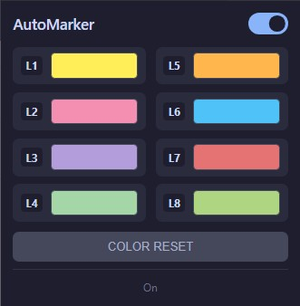
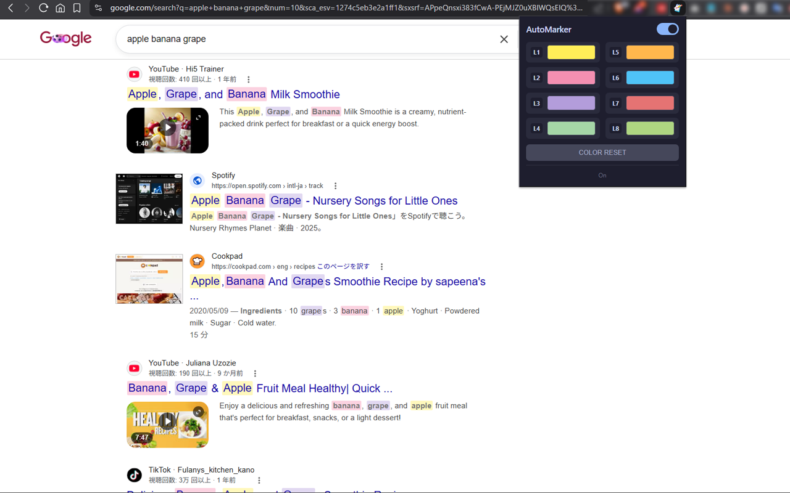

# AutoMarker Aria
【ChromeStore】\
https://chromewebstore.google.com/detail/alomlogcglnhgpphpdjpmopemacbbjld?utm_source=item-share-cb

**Your search words, instantly color-coded. No AI, no setup.**

Search the web and every word in your query lights up in its own color — right on the results page, and on the pages you click through to.

  

## What it does

- **Auto-highlights your search words** the moment you search — no typing, no config.
- **Up to 8 words, 8 distinct colors** (L1–L8), so you can track multiple terms at a glance.
- **Follows you through** — highlights stay on the pages you open from the results.
- **Works on** Google, Bing, Yahoo, DuckDuckGo, Baidu, and with infinite-scroll pages.

  

<em>Searching <code>apple banana grape</code> — each word lights up in its own color, right on the results page.</em>

## Popup controls

- **Auto toggle** — turn highlighting on or off.
- **L1–L8 color pickers** — choose the color for each of the up-to-8 search words.
- **COLOR RESET** — restore the default palette.

Your colors are saved locally and persist across sessions.

## Default palette

| Slot | Color  | Slot | Color  |
|------|--------|------|--------|
| L1   | Yellow | L5   | Orange |
| L2   | Pink   | L6   | Sky    |
| L3   | Purple | L7   | Red    |
| L4   | Green  | L8   | Lime   |

The 1st search word uses L1's color, the 2nd uses L2's, and so on up to 8.

## Install

1. Download the ZIP from [Releases](../../releases) and unzip it.
2. Open `chrome://extensions` and enable **Developer mode**.
3. Click **Load unpacked** and select the unzipped folder.

## Privacy

Everything runs locally in your browser. No data is collected or sent anywhere. Your settings live in `chrome.storage.local`.

## License

MIT
